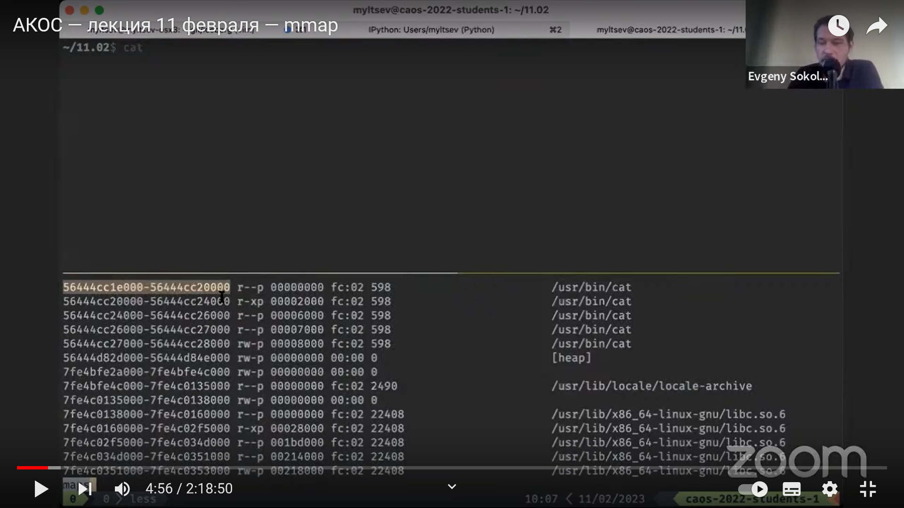
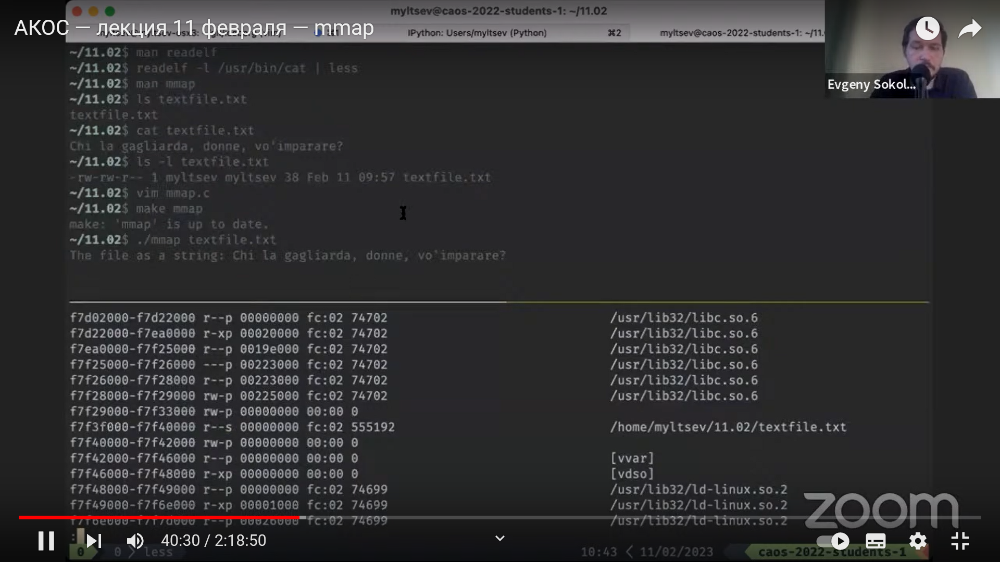
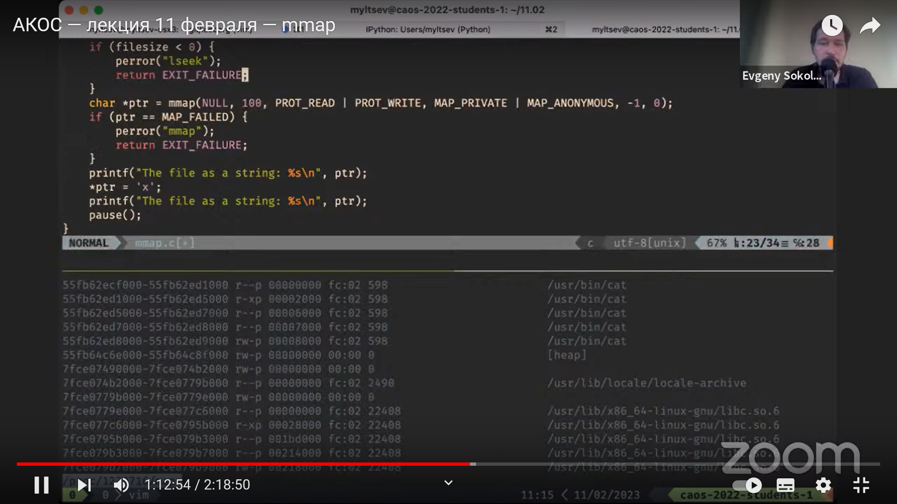

Программа cat пытается делать следующее: 

Читать стандартный вход и копировать байты из него на стандартный выход.

Мы хотим посмотреть, что ядро думает про виртуальную память.

Ядро linux предоставляет нам виртуальную файловую систему proc, которая про каждый процесс (запущенную программу)
рассказывает нам некоторую информацию.

Она, например, может рассказать, что была запущена с помощью командной строки или что у нее есть переменные окружения.

less maps - что ядро думает про память программы

* 1я колонка - диапазоны адресов виртуальной памяти (которыми пользуется программа)
* последняя колонка - из какой файла мы взяли этот кусок памяти
* буквы во второй колонке похожи на биты доступов на файлах (r, w, x значит, что его можно читать, записывать и исполнять.) 
* Например, r--p значит, что можно только читать; rw-p - можно читать и записывать, но не исполнять.
* третий столбец - смещение в файле (начиная с этого адреса лежит начало исполняемого файла)
* /usr/lib/x86_64-linux-gnu/libc.so.6 - стандартная библиотека языка C

Современные операционные системы используют страничную виртуальную память
(у процессора есть механизм, которые позволяет блоки памяти определенного размера (у нас это 4 Кб (0x1000), т.е. блоки
которые начинаются с кратным этому адресов) отображать в физической оперативной памяти с определенными
битами защиты.
(про каждую страницу можем отмечать, будет ли она доступна для чтения, записи и исполнения))

Можно предположить, что операционная система, запуская бинарник и создавая ему виртуальную память, все отображенные
страницы складывает в таблицу страниц и отдает процессору.

Но на самом деле операционная система в своих внутренних структурах данных, относящихся к этому процессу, записывает,
что есть диапазон памяти с нужными битами доступа, который отображен на какой-то файл на диске, начиная с какого-то
смещения.
А в таблицу страниц ничего не кладет.

Когда программа пытается обратиться к не отображенной памяти, процессор генерирует исключение PageFold.
В этот момент, когда программе понадобилась какая-то из страниц памяти, которую ей пообещала операционная система,
процессор генерирует Page fault, и процессор его обрабатывает.
    
То есть пока память не потрогал, операционная система не будет с ней ничего делать.
Когда потрогал, операционная система выделяет эту страницу памяти, отдает ее тебе, обработав исключение, добавляет
отображение в таблицу страниц и программа исполняется дальше.

Память изначально заполнена нулями. Если потрогаем страницу памяти, которая находится внутри кучи, то она найдет для нее
физическую память, занулит ее и добавит ее в таблицу страниц. 

Но malloc не зануляет память.

A calloc не записывает нули, потому что свежая память, которую он получает, и так зануленная (это если calloc берёт новую память у ОС (с помощью mmap), а если выдаёт старую память, которую кто-то раньше освободил, то, конечно, сам и записывает туда нули).

mmap - системный вызов, обращение к операционной системе, что начиная со смещения offset отобразить файл fd по адресу
памяти addr, отображение длины lenght и есть флаги flags.

* MAP_SHARED - то, что мы пишем в отображённую на файлы память, записывается в эти самые файлы

* MAP_PRIVATE - не записывается

Cмотрим на вывод ./mmap textfile.txt

Отображение textfile.txt получилось размера 1 страницы (4 Кб в нашем случае), и меньше отображение быть не может.

Всегда получается целое количество страниц.

То есть размер отображения всегда кратен размеру страницы.
offset тоже должен быть кратен размеру страницы.

В режиме MAP_SHARED мы не знаем, когда у нас записываются изменения.

Чтобы синхронизировать, можно сделать msync.

Когда отображение нам больше не нужно, с помощью munmap, который принимает адрес, можем удалить отображение.

Мы постоянно используем минимальное количество оперативной памяти для тех страниц, которые не изменяются. 

Если наша программа не выполняется, а выполняются другие, которым нужна оперативная память, то отображние секции text 
выгрузится. Если программа запустится, то мы всегда сможем выгрузить отображение обратно с диска.

Редактировать бинарник просто так не получится: будет ошибка Text File busy.

Бывают анонимные отображения - получаем просто участок памяти, который инициализирован нулями.

(fd = -1, указываем MAP_ANONYMOUS)

### Как искать и загружать дополнительные библиотеки? 

Мы не хотим, чтобы этим занималось ядро. Программа, которая этим занимается, называется динамический загрузчик.
Она должна исполняться в адресном пространстве той программы, в которой она загружается.

INTERP говорит, что нужно передать управление /lib/ld-linux.so.2

### Какие требования к коду разделяемых библиотек?

Что делать, если бинарник собирается по разным адресам памяти?
В случае с переменными (в отличие от переходов) мы имеем не перемещаемый код (который работает только по фиксированному
адресу памяти)

Чтобы код работал в разделяемой библиотеке и загружался в разных процессах по-разному, код должен быть перемещаемым.
Он не может обратиться по фиксированному адресу памяти - сначала он должен выяснить, где он находится в памяти, понять,
где лежат данные, к которым он хочет обратиться, а потом уже обращаться.

Есть один instruction pointer (регистр eip или rip), и на x86_32 мы не можем относительно него адресовать память, а на x86_64 можем.

Нужно предупредить компилятор, что у нас перемещаемый код.

Иначе компилятор обратится к переменной по адресу памяти.

Опция -D - показать динамические предоставляемые символы. (puts нет)

Мало просто загрузить код всех библиотек в адресное пространство, надо еще отыскать там все требуемые символы.

Мы хотим, чтобы секция .text была отображена в память read-only (так она во всех процессах будет в одних и тех же физических страницах памяти — экономия), поэтому
при релокации вытаскиваем в отдельную writable секцию, и вместо того, чтобы везде
вызывать функцию puts, мы вызываем соответствующее место plt. А уже в соответствующем месте можем сделать jmp на нужную
функцию. (на ее адрес в памяти)

Главный бинарник по умолчанию собирается с -fpie:

* более расслабленные требования к перемещаемому коду

* компилятору проще найти функции и переменные

Таким образом, механизм разделяемых библиотек предоставляет нам 2 важные вещи:

* код можно мапить в адресное пространство разных процессов 
  * Таким образом экономится физическая и оперативная память.
  
* динамическое связывание более слабое
  * Мы можем менять реализации функций и обновлять эту реализацию во всех программах, которые будут запущены на компьютере.
(например, в случае новой версии стандартной библиотеки языка C)
  
